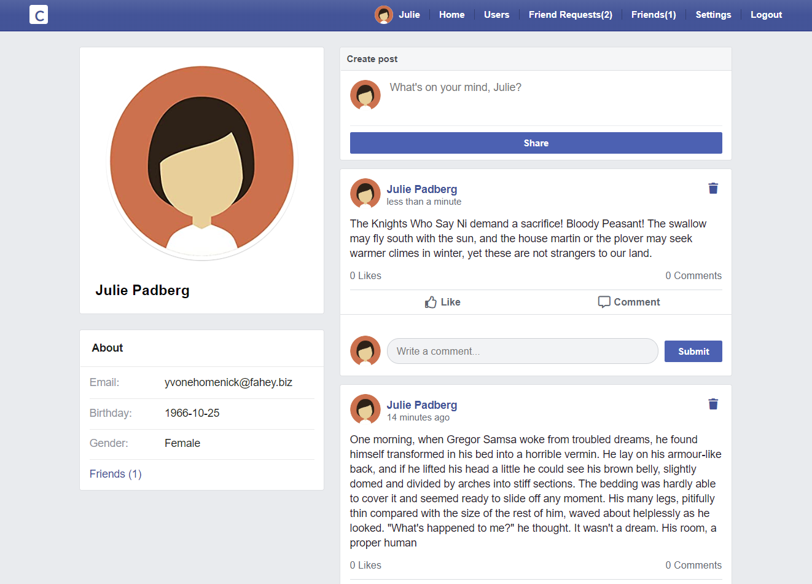
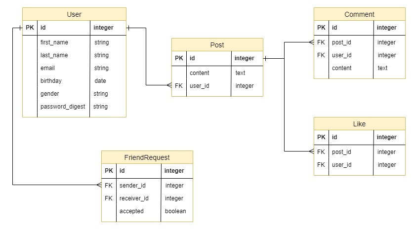

# Clonebook

> A Facebook clone website built with Ruby on Rails.



## Built With

- Ruby and Rails
- SCSS
- Tests with RSpec
- Omniauth authentication

## Features

- **Users**

  - Sign-up / login / logout.
  - Show the profile page.
  - Create / update / delete posts.

- **Posts**

  - Create / update / delete.
  - Show in chronological update order.

- **Comments**

  - Create / update / delete.

- **Likes**

  - Like / unlike posts.

- **Friendships**
  - Send / Accept a friend request.
  - Get notification from friend requests
  - Delete existing friends.
  - Feed with his own and friends' posts only.

## Data model



## Live Demo

[Live Demo](https://hidden-temple-15642.herokuapp.com)

## Prerequisites

- Ruby '~>2.6.0'
- Rails '~> 5.2.3'
- Postgresql

## Getting started

To get started with the app, clone the repo, and then install the needed gems:

```
$ bundle install --without production
```

Next, migrate the database:

```
$ rails db:migrate
```

Finally, run the test suite to verify that everything is working correctly:

```
$ rspec
```

If the test suite passes, you'll be ready to run the app in a local server:

```
$ rails server
```

## Author

👤 **Balint Mendli**

- GitHub: [@BalintMendli](https://github.com/BalintMendli)
- Website: [mendli.com](https://mendli.com)
- Email: [balint@mendli.com](mailto:balint@mendli.com)

## 🤝 Contributing

Contributions, issues, and feature requests are welcome!
Feel free to check the [issues page](https://github.com/BalintMendli/clonebook/issues/).

1. Fork it
2. Create your working branch

```
git checkout -b my-new-feature
```

3. Commit your changes

```
git commit -am 'Add some feature'
```

4. Push to the branch

```
git push origin my-new-feature
```

5. Create a new Pull Request

## Show your support

Give a ⭐️ if you like this project!

## 📝 License

This project is [MIT](LICENSE.md) licensed.
